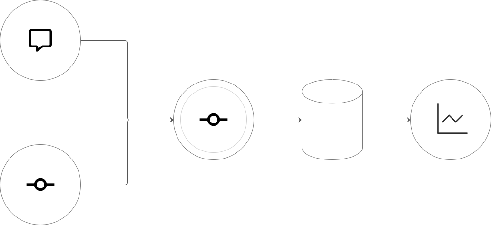

<h2 align="center">Every commit tells a story, and now you can see it.</h2>

# Entire Dashboard

A web-based analytics and visualization dashboard for data generated by [`entireio/cli`](https://github.com/entireio/cli).

**Supported platforms:** GitLab, GitHub, and Gitee.

### System Architecture

<p align="center">
  
</p>

Overall workflow: capturing conversations and events from the CLI, processing and storing them in MySQL through the core service, then visual analysis through the Dashboard.

## 🔧 Installation & Run

### 0. Install Entire CLI

This dashboard relies on data generated by Entire CLI. Please install Entire CLI from [official website](https://entire.io/home) first:

```bash
curl -fsSL https://entire.io/install.sh | bash
```

After installation, configure the CLI in your target repository to start capturing AI Agent session data. For details, see [entireio/cli](https://github.com/entireio/cli).

### Run with Docker

Recommended: Use Docker Compose to quickly start the frontend, backend, and database without installing Java, Node, or MySQL locally.

1. **Clone the repository**:
   ```bash
   git clone https://github.com/sunmh207/entire-dashboard.git
   cd entire-dashboard
   ```

2. **Start services**:
   ```bash
   docker compose up -d
   ```

3. **Access dashboard**: Open [http://localhost:81](http://localhost:81) in your browser.

4. **Login**: Default username is `admin`, default password is `admin`.

## 🚀 Quick Start (Usage)

Once the system is up and running:

1. Go to **Repositories**, add a repository, and sync its data.
2. Visit **Overview / Checkpoints** to explore your synced data.

## 📸 Screenshots

<p align="center">
  
</p>

The dashboard provides a comprehensive view of your AI agent sessions, showing checkpoint history, commit activity, and repository statistics at a glance.